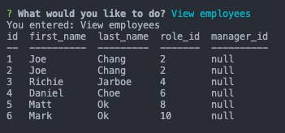

# EmployeeTracker
Unit 12 MySQL Homework: Employee Tracker

# Project Description

This project is a CLI application for creating, viewing, and editing an employee database. Built using MySQL user will be able to easily filter through the employee database. The command line application allows its user to: 
* Add departments, roles, and employees
* View department, roles, and employees  
* Update employee roles

# User Story
As a business owner
I want to be able to view and manage the departments, roles, and employees in my company
So that I can organize and plan my business

## Instructions 
User will need to run npm install for dependencies and then run node employeetracker.js. User will then choose between the options prompted. 

## Technologies Used 
* MySQL
* Node.js

## Resources 
* W3Schools
* Stackoverflow
* Codecademy

